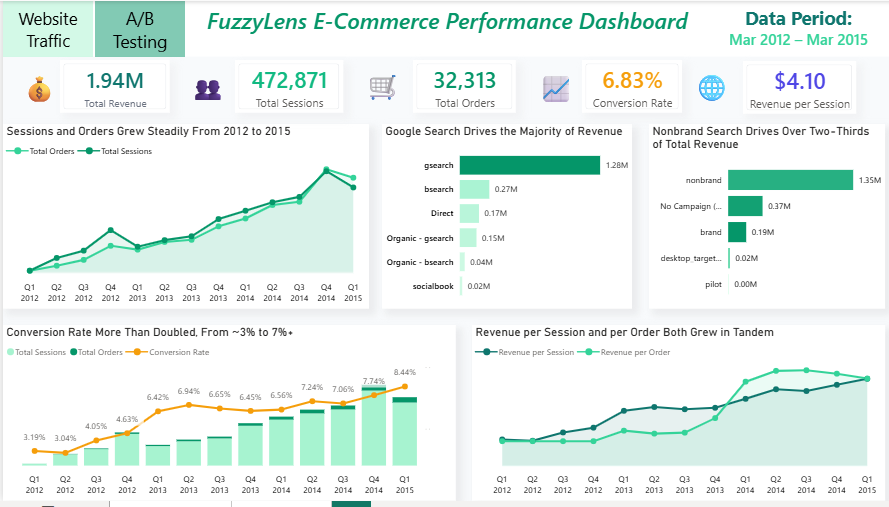
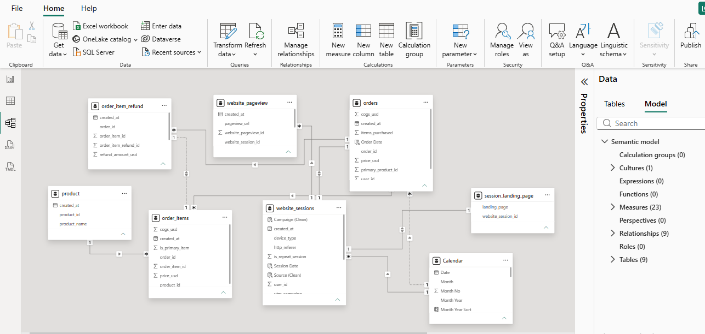
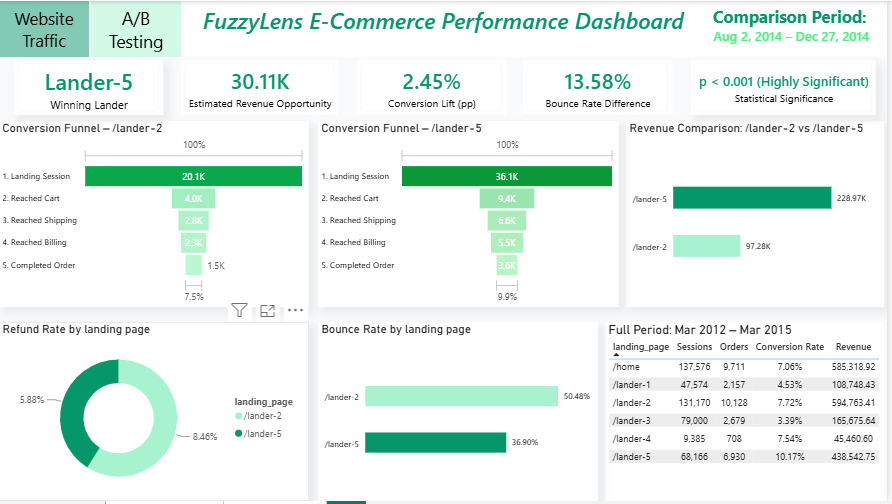

# FuzzyLens — E-Commerce Performance Dashboard

A two-page Power BI dashboard analyzing 3 years of e-commerce data (472K+ website sessions, 32K+ orders) for Maven Fuzzy Factory, built to answer core traffic/revenue questions and investigate a landing page performance opportunity in depth.

**Tools:** PostgreSQL · Power BI · DAX · Python (validation)

---

## 📊 Page 1 — Website Traffic Overview
### Page 1 — Website Traffic

Trends in sessions, orders, conversion rate, marketing channel performance, and revenue efficiency (Mar 2012 – Mar 2015).

### Business Questions
1. What is the trend in website sessions and order volume?
2. What is the session-to-order conversion rate, and how has it trended?
3. Which marketing channels have been most successful?
4. How has revenue per order and revenue per session evolved?

## Data Model

The model connects six core tables around a central `orders` / `website_sessions` relationship, with a dedicated `session_landing_page` table built specifically to support the landing page analysis.

**Schema type: Snowflake schema**

Unlike a pure star schema (one central fact table with dimensions branching directly off it), this model has multiple related fact-level tables — `website_sessions`, `website_pageview`, `orders`, `order_items`, and `order_item_refund` — connected through a chain of relationships, with `Calendar` and `product` serving as supporting dimension tables. This snowflake structure was necessary because the analysis required tracking behavior across multiple stages of the same customer journey (pageview → session → order → refund) rather than a single flat transaction table. The custom `session_landing_page` table was added as a derived lookup table to solve a specific gap: the raw data had no built-in way to identify each session's true landing page, so it was built via SQL (`ROW_NUMBER()` over `created_at` per session) and connected into the model as an additional dimension-like table.

**Key relationships:**
- `Calendar[Date]` → `orders[created_at]` and `website_sessions[created_at]` — enables consistent time-based trending across both tables from a single date axis.
- `website_sessions[website_session_id]` → `orders[website_session_id]` — links each order back to its originating session.
- `website_pageview[website_session_id]` → `website_sessions[website_session_id]` — supports funnel-stage tracking (landing → cart → shipping → billing → completed order).
- `session_landing_page[website_session_id]` → `website_sessions[website_session_id]` (1:1) — a custom SQL view built to correctly identify each session's true landing page, since the raw data had no landing-page flag. Derived using `ROW_NUMBER()` over `created_at` per session.
- `order_items[order_id]` → `orders[order_id]` — line-item level detail for each order.
- `order_item_refund[order_id]` → `orders[order_id]` — supports refund rate validation used in the A/B Testing analysis.
- `product[product_id]` → `order_items[product_id]` — product-level detail for line items.

This structure allowed conversion rate, revenue, and funnel measures to stay filterable by both landing page and date range simultaneously — essential for the overlap-window comparison in the A/B Testing analysis.

### Finding
- Sessions and orders both grew steadily from March 2012 to March 2015.
- Conversion rate more than doubled — from ~3% to over 7%.
- Nonbrand Search campaigns drove over two-thirds of total revenue.
- Google Search was the single largest source of both traffic and sales.
- Revenue per session and revenue per order both trended upward over the same period, indicating the business was getting more efficient at monetizing traffic, not just growing traffic volume.

### Action
- Built a Calendar (date) table with a numeric `YearMonth` key to enable clean, chronologically-sorted monthly trending across sessions, orders, and revenue.
- Cleaned `utm_source` and `http_referer` fields to resolve literal `"NULL"` text strings (a CSV import artifact) into accurate **Direct** and **Organic** traffic labels, preventing an undercount of real channel performance.
- Used insight-driven chart titles (e.g., *"Nonbrand Search Drives Over Two-Thirds of Total Revenue"*) so the dashboard communicates findings at a glance, not just raw numbers.

### Impact
A stakeholder can see, in under 10 seconds, that the business is growing on both traffic and efficiency — and that continued investment in Nonbrand Search is well-supported by the data.

---

## 🔍 Page 2 — Landing Page Performance Deep-Dive
### Page 2 — A/B Testing

Landing page performance deep-dive comparing the site's highest-revenue page against its highest-converting page, with funnel, bounce rate, refund rate, and statistical significance analysis.
### Problem Faced
The site had tested **6 different landing pages** over 3 years, each launched and retired at different, mostly non-overlapping times. A naive full-history comparison of conversion rates would be misleading — it would conflate genuine page performance with seasonal and timing effects.

### Why These Two Pages
Rather than compare all 6 pages carte blanche, I filtered for the only pair that allowed a fair, defensible comparison:
1. **Overlapping live period** — `/lander-2` and `/lander-5` were the only two pages that ran simultaneously for a meaningful window (Aug 2 – Dec 27, 2014), controlling for seasonality.
2. **Sufficient traffic volume** — both had tens of thousands of sessions in that window, ruling out small-sample noise.
3. **Comparable traffic sources** — verified that ~95%+ of both pages' traffic came from the same channels (gsearch/bsearch, nonbrand), ruling out "different visitor quality" as a confound.
4. **Business relevance** — `/lander-2` was the site's current highest-revenue page; `/lander-5` was its highest-converting page. Comparing the revenue leader against the conversion leader is a genuinely useful business question.

### Finding
- During the shared window, `/lander-5` converted visitors at **9.95%** vs. **7.48%** for `/lander-2` — a statistically significant difference confirmed with a two-proportion z-test (**p < 0.001**).
- A funnel analysis (Landing → Cart → Shipping → Billing → Completed Order) showed the gap originates almost entirely at the **first step**: `/lander-5` converted 26% of visitors into the cart stage vs. only 20% for `/lander-2`. From cart onward, both pages performed nearly identically.
- `/lander-2` had a **50% bounce rate** — half of all visitors left without viewing a second page — compared to **37%** for `/lander-5`.
- `/lander-5`'s higher conversion wasn't coming at the cost of order quality: it also had a **lower refund rate** (5.9% vs. 8.5%).

### Action
- Built a `session_landing_page` SQL view to correctly derive each session's true landing page (`MIN(created_at)` per session), since the raw data had no landing-page flag.
- Validated the comparison window explicitly, rejecting an initial full-history estimate ($249K) once time-overlap analysis showed it wasn't a fair comparison — recalculated using only the true overlapping window.
- Ran a two-proportion z-test in Python to confirm statistical significance rather than relying on the raw percentage gap alone.
- Checked refund rate and bounce rate as secondary validation, ruling out "quantity over quality" as an alternate explanation for the conversion gap.

### Impact
- **Estimated revenue opportunity: ~$30,000 (a ~31% lift)** during the 5-month overlap window alone, if `/lander-2`'s traffic had converted at `/lander-5`'s rate.
- **Recommendation:** Replace `/lander-2` with `/lander-5` as the default landing page, and use `/lander-5` as the baseline for future landing page tests. Pair this with continued investment in Nonbrand Search — the channel already proven (Page 1) to drive the most revenue — to route more qualified traffic toward the better-converting page.

---

## 🧠 Key Takeaway

The most important finding in this project wasn't a chart — it was a methodology correction. An initial, uncontrolled comparison suggested a ~$249K opportunity. After verifying that the two pages never actually ran during the same time period, and restricting the analysis to the true overlapping window, the defensible number dropped to ~$30K.

**Good analysis isn't about finding the biggest number — it's about finding the number you can confidently stand behind.**

---

## 📂 Project Structure
- SQL: session landing-page derivation, cohort/overlap-window queries, refund and bounce rate validation
- Power BI: DAX measures for conversion rate, revenue, funnel stages, and statistical KPIs
- Python: two-proportion z-test and chi-square validation of the conversion rate difference
