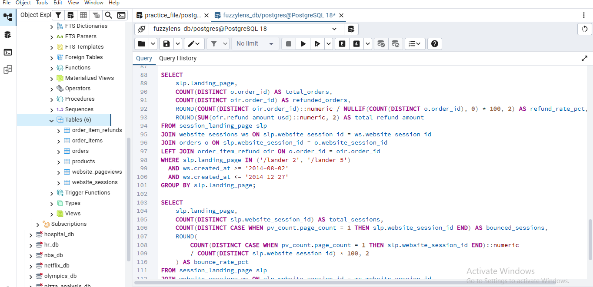
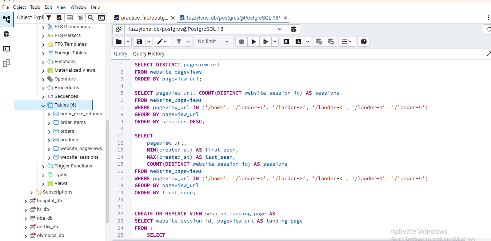
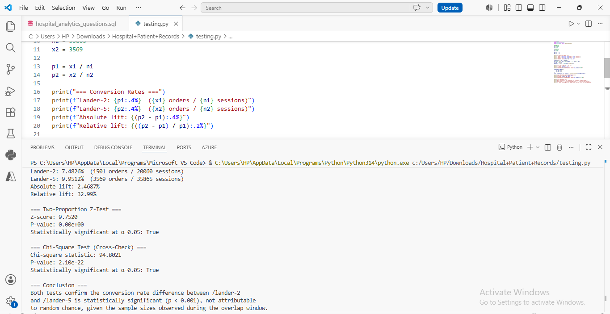

# FuzzyLens — E-Commerce Performance Dashboard

A two-page Power BI dashboard analyzing 3 years of e-commerce data (472K+ website sessions, 32K+ orders) for Maven Fuzzy Factory, built to answer core traffic/revenue questions and investigate a landing page performance opportunity in depth.

**Tools:** PostgreSQL · Power BI · DAX · Python

---

## Business Problem

Maven Fuzzy Factory wanted to understand what was driving website growth and whether there were untapped conversion opportunities. This project set out to answer four core business questions:

1. What is the trend in website sessions and order volume?
2. What is the session-to-order conversion rate, and how has it trended?
3. Which marketing channels have been most successful?
4. How has revenue per order and revenue per session evolved?

While exploring the data, a fifth question emerged: the site had tested 6 different landing pages over time. Rather than stop at "which page converts better," the goal became understanding *why* — and making sure any comparison drawn was actually fair.

---

## Dataset

E-commerce transactional data covering March 2012 – March 2015:
- **472,871** website sessions
- **32,313** orders
- Core tables: `website_sessions`, `website_pageview`, `orders`, `order_items`, `order_item_refund`, `product`

---

## Data Model

The model connects six core tables around a central `orders` / `website_sessions` relationship, with a dedicated `session_landing_page` table built specifically to support the landing page analysis.


**Schema type: Snowflake schema**

Unlike a pure star schema (one central fact table with dimensions branching directly off it), this model has multiple related fact-level tables — `website_sessions`, `website_pageview`, `orders`, `order_items`, and `order_item_refund` — connected through a chain of relationships, with `Calendar` and `product` serving as supporting dimension tables. This structure was necessary to track behavior across multiple stages of the same customer journey (pageview → session → order → refund) rather than a single flat transaction table. The custom `session_landing_page` table was added as a derived lookup table to solve a specific gap: the raw data had no built-in way to identify each session's true landing page, so it was built via SQL (`ROW_NUMBER()` over `created_at` per session) and connected into the model as an additional dimension-like table.

**Key relationships:**
- `Calendar[Date]` → `orders[created_at]` and `website_sessions[created_at]` — enables consistent time-based trending across both tables from a single date axis.
- `website_sessions[website_session_id]` → `orders[website_session_id]` — links each order back to its originating session.
- `website_pageview[website_session_id]` → `website_sessions[website_session_id]` — supports funnel-stage tracking (landing → cart → shipping → billing → completed order).
- `session_landing_page[website_session_id]` → `website_sessions[website_session_id]` (1:1) — a custom SQL view built to correctly identify each session's true landing page.
- `order_items[order_id]` → `orders[order_id]` — line-item level detail for each order.
- `order_item_refund[order_id]` → `orders[order_id]` — supports refund rate validation used in the A/B Testing analysis.
- `product[product_id]` → `order_items[product_id]` — product-level detail for line items.

---

## SQL Analysis

To identify the true landing page for each session and validate the /lander-2 vs /lander-5 comparison, I wrote a series of PostgreSQL queries — from checking traffic volume and active date ranges, to building a custom view, to validating traffic source parity, refund rates, and bounce rates.

📄 [View full SQL script](fuzzylens_ab_testing_queries.sql)

**Query: Checking available landing page URLs**



**Query: Session volume and date range per landing page**



These initial checks revealed that the site had tested 6 different landing pages over time, most of which ran during different, non-overlapping periods — making a fair comparison require filtering down to the two pages that shared a common live window (Aug 2 – Dec 27, 2014).

I also built a `session_landing_page` view using `ROW_NUMBER()` over `created_at` per session, since the raw data had no built-in landing-page flag:

```sql
CREATE OR REPLACE VIEW session_landing_page AS
SELECT website_session_id, pageview_url AS landing_page
FROM (
    SELECT 
        website_session_id, 
        pageview_url,
        ROW_NUMBER() OVER (PARTITION BY website_session_id ORDER BY created_at ASC) AS rn
    FROM website_pageview
) ranked
WHERE rn = 1;
```

---

## Statistical Analysis

To confirm the landing page conversion rate difference wasn't due to random chance, I ran a two-proportion z-test and a chi-square test of independence in Python.



📄 [statistical_analysis.py](statistical_analysis.py)

**Result:**
- Z-score: 9.75
- P-value: 2.10 × 10⁻²² (chi-square cross-check)
- **Statistically significant at p < 0.001**

This confirms the 2.47 percentage point conversion rate gap between `/lander-2` (7.48%) and `/lander-5` (9.95%) is a real, reliable difference — not sampling noise — given the sample sizes observed during the overlap window (55,925 combined sessions).

---

## Dashboard

### Page 1 — Website Traffic


Trends in sessions, orders, conversion rate, marketing channel performance, and revenue efficiency (Mar 2012 – Mar 2015).

### Page 2 — A/B Testing


Landing page performance deep-dive comparing the site's highest-revenue page against its highest-converting page, with funnel, bounce rate, refund rate, and statistical significance analysis.

---

## Key Insights

**Website Traffic:**
- Sessions and orders both grew steadily from March 2012 to March 2015.
- Conversion rate more than doubled — from ~3% to over 7%.
- Nonbrand Search campaigns drove over two-thirds of total revenue.
- Google Search was the single largest source of both traffic and sales.
- Revenue per session and revenue per order both trended upward, indicating the business was getting more efficient at monetizing traffic, not just growing traffic volume.

**Landing Page A/B Testing:**
- The site had tested 6 different landing pages over 3 years, most running during different, non-overlapping periods. I filtered for the only pair — `/lander-2` and `/lander-5` — that overlapped for a meaningful window, had sufficient traffic, and drew from comparable traffic sources (~95%+ from the same channels).
- During the shared window, `/lander-5` converted visitors at **9.95%** vs. **7.48%** for `/lander-2` — statistically significant (p < 0.001).
- A funnel analysis (Landing → Cart → Shipping → Billing → Completed Order) showed the gap originates almost entirely at the **first step**: `/lander-5` converted 26% of visitors into the cart stage vs. only 20% for `/lander-2`. From cart onward, both pages performed nearly identically.
- `/lander-2` had a **50% bounce rate** — half of all visitors left without viewing a second page — compared to **37%** for `/lander-5`.
- `/lander-5`'s higher conversion wasn't coming at the cost of order quality: it also had a **lower refund rate** (5.9% vs. 8.5%).
- **Estimated revenue opportunity: ~$30,000 (a ~31% lift)** during the 5-month overlap window alone, if `/lander-2`'s traffic had converted at `/lander-5`'s rate.

---

## Recommendations

1. **Replace `/lander-2` with `/lander-5`** as the default landing page, given its statistically significant lead in conversion rate, lower bounce rate, and lower refund rate.
2. **Use `/lander-5` as the baseline** for future landing page A/B tests, rather than testing new variants against `/lander-2`.
3. **Continue investing in Nonbrand Search** — the channel already proven to drive the most revenue — and route more of that qualified traffic toward the better-converting landing page.
4. **Investigate what specifically drives the bounce rate gap** at the first interaction (page load speed, above-the-fold messaging, imagery) since that's where nearly the entire conversion advantage originates.

---

## Future Work

- **Annualized impact projection:** A rough extrapolation of the 5-month lift to a full year suggests a ~$100K annual opportunity. This wasn't included as a validated finding since it assumes traffic patterns stay consistent outside the observed window (which includes the holiday season) — a full year of overlapping data would be needed to confirm it.
- **Segment the conversion gap** by device type, new vs. returning visitor, and marketing channel to see if `/lander-5`'s advantage holds consistently or is concentrated in specific segments.
- **Run a true randomized A/B test** going forward (simultaneous launch, random traffic split) to build on this natural comparison with a fully controlled experiment.

---

## Key Takeaway

The most important finding in this project wasn't a chart — it was a methodology correction. An initial, uncontrolled comparison suggested a ~$249K opportunity. After verifying that the two pages never actually ran during the same time period, and restricting the analysis to the true overlapping window, the defensible number dropped to ~$30K.

**Good analysis isn't about finding the biggest number — it's about finding the number you can confidently stand behind.**
